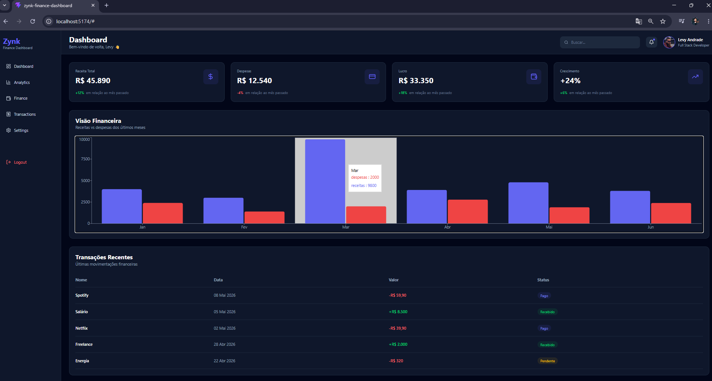

# 🚀 Zynk Finance Dashboard

Um dashboard financeiro moderno desenvolvido com React, Vite e Tailwind CSS.

O projeto foi criado com foco em:
- UI moderna
- Componentização
- Responsividade
- Arquitetura escalável
- Experiência visual estilo SaaS

---

# 📸 Preview



---

# ✨ Funcionalidades

✅ Sidebar moderna e responsiva  
✅ Cards financeiros dinâmicos  
✅ Gráficos financeiros com Recharts  
✅ Tabela de transações  
✅ Simulação de API  
✅ Skeleton Loading  
✅ Layout profissional estilo SaaS  
✅ Estrutura escalável para futuras funcionalidades  

---

# 🛠️ Tecnologias Utilizadas

- React
- Vite
- Tailwind CSS
- Recharts
- Lucide React
- JavaScript ES6+

---

# 📂 Estrutura do Projeto

```bash
src
 ├── api
 ├── components
 │   ├── cards
 │   ├── charts
 │   ├── layout
 │   └── tables
 ├── data
 ├── App.jsx
 ├── main.jsx
 └── index.css
```

---

# ⚙️ Instalação

Clone o projeto:

```bash
git clone https://github.com/SEU-USUARIO/zynk-finance-dashboard.git
```

Entre na pasta:

```bash
cd zynk-finance-dashboard
```

Instale as dependências:

```bash
npm install
```

Execute o projeto:

```bash
npm run dev
```

---

# 🎯 Objetivo do Projeto

Este projeto foi desenvolvido para fins de estudo e portfólio, com o objetivo de praticar:

- React moderno
- Hooks
- Componentização
- Organização de código
- Estrutura de dashboards profissionais
- Integração de dados simulados
- UI/UX moderna

---

# 📌 Futuras Melhorias

- Autenticação de usuários
- Integração com backend real
- Banco de dados
- Dark/Light mode avançado
- Dashboard mobile completo
- Sistema de filtros
- Exportação de relatórios

---

# 👨‍💻 Autor

Desenvolvido por **Levy Andrade**

- LinkedIn: https://www.linkedin.com/in/levy-andrade/
- GitHub: https://github.com/Levy-Andrade

---

# ⭐ Considerações

Se gostou do projeto, deixe uma estrela no repositório ⭐
